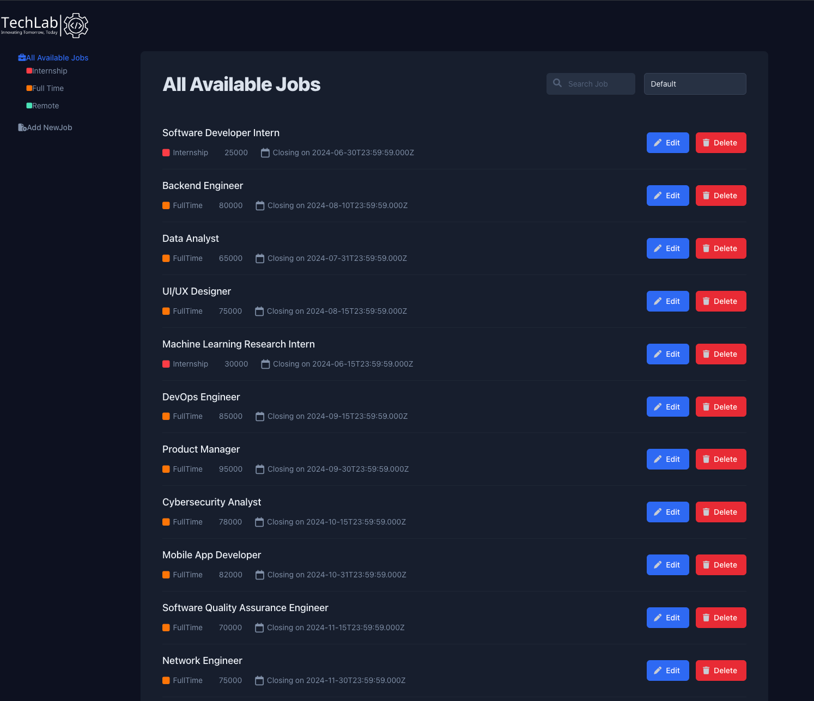
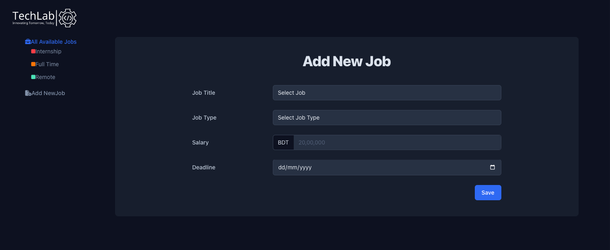

# Techlab JobFinder

Techlab JobFinder is a web application designed to streamline job management
tasks such as viewing, adding, editing, and deleting job listings. It provides
features to filter jobs by type, search for specific jobs, and sort jobs by
salary. This README provides an overview of the project structure, technologies
used, API endpoints, and screenshots.

## Features

- **Job Management:** Fetch jobs from a backend server and display them in a
  list with different colors based on job types (Internship, Full Time, Remote).
- **Add New Jobs:** Use a form page with React Router Dom and Redux to add new
  jobs, saving data to the backend server.
- **Filter and Sort:** View all available jobs or filter jobs by types such as
  Internship, Full Time, and Remote. Sort jobs by salary in ascending or
  descending order.
- **Edit and Delete:** Edit job details or delete jobs directly from the UI,
  reflecting changes in the backend server.

## Technologies Used

- **Frontend:** React.js, Redux Toolkit, React Router Dom, HTML5, CSS3,
  JavaScript (ES6+)
- **Backend:** Node.js, Express.js, PostgreSQL (Backend Database), Prisma (ORM
  for PostgreSQL)
- **API Testing:** Postman (for API endpoint testing)

## Project Structure

```
techlab-jobfinder/
│
├── public/
├── src/
│   ├── components/
│   │   ├── Header.js
│   │   ├── Root.js
│   │   └── ...
│   ├── pages/
│   │   ├── HomePage.js
│   │   ├── AddJob.js
│   │   ├── EditJob.js
│   │   └── ...
│   ├── features/jobs
│   │   ├── jobsApi.js
│   │   ├── jobsSLice.js
│   │   └── ...
│   ├── app/
│   │   ├── store.js
│   │   └── ...
│   ├── App.js
│   ├── index.js
│   └── ...
│
├── package.json
├── README.md
└── ...

```

- **`src/components/`:** Contains React components like JobList, JobForm, etc.
- **`src/pages/`:** Contains React components representing different pages like
  Home, CreateJob, EditJob, etc.
- **`src/store/`:** Includes Redux actions, reducers, and store configuration.
- **`src/services/`:** Contains service files for interacting with the backend
  API.

## API Endpoints

- **GET `/api/jobs`:** Fetch all jobs.
- **POST `/api/jobs`:** Add a new job.
- **PATCH `/api/jobs/:id`:** Update a job by ID.
- **DELETE `/api/jobs/:id`:** Delete a job by ID.

## Screenshots

 

## Live Demo

Explore the live demo of the project
[here](https://techlab-job-finder.vercel.app/).

